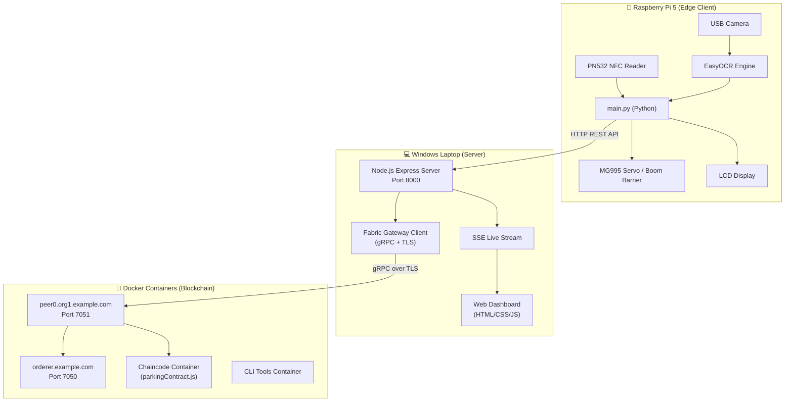

# 🅿️ Smart Parking System — Complete Project Overview

> **Presentation Reference Document**
> A blockchain-powered automated parking management system using IoT hardware (Raspberry Pi 5), Hyperledger Fabric, and a real-time web dashboard.

---

## 1. What This Project Does (The Big Picture)

This is an **end-to-end smart parking system** that automates vehicle entry and exit at a parking lot using:

| Step | What Happens | Technology Used |
|------|-------------|-----------------|
| 1 | Driver taps NFC card at the gate | PN532 NFC Reader on Raspberry Pi 5 |
| 2 | System verifies the card owner on the blockchain | Hyperledger Fabric Ledger |
| 3 | Camera scans the vehicle license plate | USB Camera + EasyOCR |
| 4 | System cross-verifies that the plate belongs to the card owner | Smart Contract on Blockchain |
| 5 | Boom barrier opens automatically | MG995 Servo via PCA9685 Driver |
| 6 | On exit, parking fee is calculated and recorded | Smart Contract calculates based on duration |
| 7 | Admin monitors everything live on a web dashboard | Real-time SSE (Server-Sent Events) |

**Key Selling Point:** Every transaction (entry, exit, fee) is recorded on an **immutable blockchain ledger**, preventing any tampering or disputes.

---

## 2. System Architecture



---

## 3. Technology Stack

| Layer | Technology | Version | Purpose |
|-------|-----------|---------|---------|
| **Blockchain** | Hyperledger Fabric | v2.5 | Decentralized immutable ledger |
| **Smart Contract** | Node.js (fabric-contract-api) | v2.5.0 | Business logic on the blockchain |
| **Backend Server** | Node.js + Express | v5.2.1 | REST API server |
| **Blockchain SDK** | @hyperledger/fabric-gateway | v1.11.0 | Connects server to blockchain peers |
| **gRPC** | @grpc/grpc-js | v1.14.4 | Transport protocol for blockchain communication |
| **Frontend** | HTML5 + Vanilla CSS + JavaScript | — | Admin web dashboard |
| **Edge Client** | Python 3 | — | Raspberry Pi hardware controller |
| **NFC** | adafruit-circuitpython-pn532 | — | NFC card reading library |
| **OCR** | EasyOCR | — | License plate text recognition |
| **Camera** | OpenCV (opencv-python-headless) | — | Image capture from USB camera |
| **Servo Control** | adafruit-circuitpython-pca9685 | — | PWM servo motor driver |
| **Containerization** | Docker / Docker Compose | — | Runs all Fabric nodes |
| **Consensus** | Raft (etcdraft) | — | Ordering service consensus algorithm |

---

## 4. Complete Folder Structure

```
smart-parking/
│
├── 📁 chaincode/node/                ← BLOCKCHAIN SMART CONTRACT
│   ├── index.js                      ← Entry point, exports ParkingContract
│   ├── lib/parkingContract.js        ← ⭐ THE CORE BUSINESS LOGIC (all functions)
│   └── package.json                  ← Dependencies: fabric-contract-api, fabric-shim
│
├── 📁 fabric-network/                ← BLOCKCHAIN NETWORK CONFIGURATION
│   ├── docker-compose.yaml           ← Defines 3 Docker containers (peer, orderer, cli)
│   ├── configtx.yaml                 ← Channel & organization policies
│   ├── crypto-config.yaml            ← Certificate generation template
│   ├── crypto-config/                ← Generated TLS certificates & keys
│   ├── channel-artifacts/            ← Generated genesis block & channel tx
│   ├── network.ps1                   ← PowerShell script to start/stop network
│   ├── network.sh                    ← Bash script to start/stop network (Linux)
│   └── deployCC.ps1                  ← Script to package & deploy chaincode upgrades
│
├── 📁 server-node/                   ← BACKEND SERVER (Node.js)
│   ├── index.js                      ← ⭐ Express server entry point (port 8000)
│   ├── package.json                  ← Server dependencies
│   ├── config/
│   │   └── settings.json             ← Server config (port, fees, fabric paths)
│   ├── fabric/
│   │   └── fabricClient.js           ← ⭐ Fabric Gateway connector (gRPC + TLS)
│   ├── routes/
│   │   └── api.js                    ← ⭐ All REST API endpoints + SSE stream
│   └── client/                       ← FRONTEND DASHBOARD
│       ├── index.html                ← Dashboard HTML structure
│       ├── style.css                 ← Glassmorphism dark-mode styling
│       └── app.js                    ← Dashboard JavaScript logic + SSE listener
│
├── 📁 raspberry_pi/                  ← EDGE CLIENT (Raspberry Pi 5)
│   ├── main.py                       ← ⭐ Main parking flow controller
│   ├── config.py                     ← Server URL, pin configs, camera settings
│   ├── requirements.txt              ← Python dependencies
│   └── hardware/                     ← Hardware abstraction modules
│       ├── pn532.py                  ← NFC card reader (I2C, PN532)
│       ├── camera.py                 ← USB camera capture (OpenCV)
│       ├── ocr.py                    ← License plate recognition (EasyOCR)
│       ├── servo.py                  ← Boom barrier motor (PCA9685 + MG995)
│       └── display.py                ← LCD display output
│
├── 📁 scripts/                       ← STARTUP SCRIPTS
│   ├── start_server.bat              ← Windows: starts Node.js server
│   ├── start_server.sh               ← Linux: starts Node.js server
│   ├── start_raspberry_pi.sh         ← Pi: activates venv & runs main.py
│   └── smart_parking.service         ← Systemd service file for Linux deployment
│
├── 📁 bin/                           ← Fabric CLI binaries (cryptogen, configtxgen)
├── 📁 docs/                          ← Setup documentation
└── 📁 docker/                        ← Alternative docker compose files
```

---

## 5. File-by-File Explanation

### 5.1 Smart Contract — `chaincode/node/lib/parkingContract.js`

> [!IMPORTANT]
> This is the **most critical file** in the entire project. It contains all the business rules that run **on the blockchain itself**, inside a Docker container.

| Function | Type | What It Does |
|----------|------|-------------|
| `registerUser(uid, name, plate)` | Write | Stores `USER_{uid}` and `VEHICLE_{plate}` on the ledger |
| `verifyUID(uid)` | Read | Checks if a given NFC UID is registered |
| `verifyVehicle(uid, plate)` | Read | Cross-checks that the plate belongs to the UID owner |
| `deleteUser(uid, plate)` | Write | Removes USER, VEHICLE, and ENTRY keys from the ledger |
| `createEntry(uid, plate)` | Write | Records entry timestamp under `ENTRY_{uid}` |
| `createExit(uid, plate, fee1, fee2)` | Write | Calculates fee, saves to `HISTORY_{uid}_{time}`, deletes active entry |
| `getParkingHistory(uid)` | Read | Fetches all historical parking records for a UID |
| `getVehicleStatus(uid)` | Read | Returns `INSIDE` or `OUTSIDE` with details |

**Ledger Key Schema:**
```
USER_14DBF6A7    → { uid, ownerName, vehicleNumber, status, timestamp }
VEHICLE_KA01AB1234 → "14DBF6A7"   (maps plate → UID for OCR verification)
ENTRY_14DBF6A7   → { txId, uid, vehicleNumber, entryTime, ... }   (active parking)
HISTORY_14DBF6A7_1782978369 → { txId, entryTime, exitTime, duration, fee }   (completed)
```

---

### 5.2 Backend Server — `server-node/index.js`

This is the **Express.js server** that acts as the bridge between the Raspberry Pi and the Blockchain.

**What it does:**
- Starts an HTTP server on **port 8000** (`0.0.0.0` — accessible from other devices on the network)
- Connects to the Hyperledger Fabric blockchain via gRPC on startup (gRPC stands for Google Remote Procedure Call)
- Serves the frontend dashboard at `/dashboard`
- Routes all API calls through `/api/v1/*` api.js — all your REST endpoints (register, verify, entry, exit, etc.)
- Automatically opens the dashboard in your default browser when started
- Handles graceful shutdown (disconnects from Fabric cleanly)

---

### 5.3 Fabric Gateway — `server-node/fabric/fabricClient.js`

> [!IMPORTANT]
> This file is the **communication bridge** between your Node.js server and the blockchain Docker containers.

**How the connection works:**
1. Reads TLS certificates from `fabric-network/crypto-config/`
2. Creates a **gRPC connection** (encrypted with TLS) to `peer0.org1.example.com:7051`
3. Authenticates as `User1@org1.example.com` using MSP identity `Org1MSP`
4. Exposes two functions used by the API:
   - `invokeTransaction()` → **Writes** to the blockchain (submit transaction to orderer)
   - `queryTransaction()` → **Reads** from the blockchain (evaluate locally on peer, no consensus needed)
5. Has a **MOCK mode** — if crypto certificates are missing, it returns fake data so you can test without Docker

---

### 5.4 REST API — `server-node/routes/api.js`

All HTTP endpoints that the Raspberry Pi and Dashboard call:

| Method | Endpoint | Who Calls It | Purpose |
|--------|----------|-------------|---------|
| `POST` | `/api/v1/verifyUID` | Pi | Check if NFC card is registered |
| `POST` | `/api/v1/register` | Dashboard | Register a new NFC card + vehicle |
| `DELETE` | `/api/v1/delete` | Dashboard | Delete a registration from ledger |
| `POST` | `/api/v1/verifyVehicle` | Pi | Cross-check plate matches NFC owner |
| `POST` | `/api/v1/entry` | Pi | Record vehicle entry on blockchain |
| `POST` | `/api/v1/exit` | Pi | Record vehicle exit, calculate fee |
| `GET` | `/api/v1/history/:uid` | Dashboard | Fetch all past parking sessions |
| `GET` | `/api/v1/status/:uid` | Pi / Dashboard | Check if vehicle is INSIDE or OUTSIDE |
| `GET` | `/api/v1/stream` | Dashboard | **SSE stream** — real-time events pushed to browser |

**Server-Sent Events (SSE):**
Every API call also broadcasts a real-time event (e.g., `NFC_SCANNED`, `ENTRY_APPROVED`, `OCR_MISMATCH`) to all connected dashboards via the `/stream` endpoint.

---

### 5.5 Frontend Dashboard — `server-node/client/`

A single-page admin dashboard built with **pure HTML/CSS/JavaScript** (no React, no frameworks).

| File | Purpose |
|------|---------|
| `index.html` | Dashboard structure: Registration form, Status search, History table, Live feed |
| `style.css` | **Glassmorphism** dark-mode design with animated gradient orbs, hover effects, pulse animations |
| `app.js` | Handles form submissions, API calls, SSE live feed listener, Delete confirmation |

**Dashboard Features:**
1. **Register Vehicle** — Enter NFC UID, Owner Name, Vehicle Number → writes to blockchain
2. **Delete Vehicle** — Enter NFC UID and Vehicle Number → removes from blockchain (with confirmation dialog)
3. **Search Status** — Enter UID → shows INSIDE/OUTSIDE status + full parking history table
4. **Live Activity Log** — Real-time streaming feed showing every NFC scan, OCR match, entry/exit from the Pi

---

### 5.6 Raspberry Pi Client — `raspberry_pi/`

The **Python application** that runs on the Raspberry Pi 5 at the physical parking gate.

#### `main.py` — The Main Flow
```
┌─────────────────────────────────────────────────────┐
│  INFINITE LOOP:                                      │
│                                                      │
│  1. Display "Tap your Card" on LCD                   │
│  2. Wait for NFC card swipe (blocking)               │
│  3. POST /verifyUID → Is this card registered?       │
│     ├── ❌ NO → Display "ACCESS DENIED", wait 3s     │
│     └── ✅ YES → Continue                            │
│  4. Capture image with USB camera                    │
│  5. Run EasyOCR → Extract license plate text         │
│  6. POST /verifyVehicle → Does plate match card?     │
│     ├── ❌ NO → Display "MISMATCH", wait 3s          │
│     └── ✅ YES → Continue                            │
│  7. GET /status/{uid} → Is vehicle INSIDE or OUTSIDE?│
│     ├── OUTSIDE → POST /entry (record entry)         │
│     │             Display "WELCOME"                  │
│     └── INSIDE  → POST /exit (record exit + fee)     │
│                   Display "FEE: Rs XXX, GOODBYE"     │
│  8. Open servo barrier → Wait 10 seconds → Close     │
│  9. Loop back to step 1                              │
└─────────────────────────────────────────────────────┘
```

#### Hardware Modules (`hardware/`)

| File | Hardware | Communication | Purpose |
|------|----------|--------------|---------|
| `pn532.py` | PN532 NFC Module | I2C (SDA/SCL) | Reads NFC card UID as hex string (e.g., `14DBF6A7`) |
| `camera.py` | USB Webcam | USB | Captures vehicle image at 1280×720 resolution |
| `ocr.py` | — (Software) | — | Preprocesses image (grayscale → bilateral filter → threshold) then runs EasyOCR. Filters results by 5-12 alphanumeric chars |
| `servo.py` | MG995 Servo via PCA9685 | I2C (addr `0x40`) | Converts angle to PWM duty cycle. Open = 90°, Close = 0° |
| `display.py` | LCD/OLED Display | I2C | Shows status messages (currently prints to terminal) |

---

## 6. How Server and Client Communicate

### 6.1 Raspberry Pi → Server (HTTP REST)

```
Raspberry Pi (Python)                    Server (Node.js)
─────────────────────                    ────────────────
    requests.post()      ──── HTTP ────>   Express router
                         <── JSON ────     API response
```

- Protocol: **HTTP** (plain, not HTTPS)
- Format: **JSON** request/response bodies
- Server URL configured in `raspberry_pi/config.py` → `SERVER_URL`
- Pi must be on the **same Wi-Fi/LAN** as the server laptop

### 6.2 Server → Blockchain (gRPC + TLS)

```
Express Server                           Docker Containers
──────────────                           ─────────────────
fabricClient.js          ── gRPC/TLS ──>  peer0 (port 7051)
                                          │
                                          ├── Evaluates queries locally
                                          └── Submits writes to orderer (port 7050)
                                                   │
                                                   └── Orderer creates block
                                                       └── Block sent back to peer
```

- Protocol: **gRPC over TLS** (encrypted)
- Authentication: X.509 certificates from `crypto-config/`
- Two types of calls:
  - **Query** (`evaluateTransaction`): Read-only, fast, no consensus needed
  - **Invoke** (`submitTransaction`): Write operation, goes through ordering and consensus

### 6.3 Server → Dashboard (SSE + HTTP)

```
Browser Dashboard                        Express Server
─────────────────                        ──────────────
  EventSource('/stream')  ── SSE ──────>  Keeps connection open
                          <── Push ────   Broadcasts events in real-time
  fetch('/api/v1/...')    ── HTTP ──────>  Standard REST calls
                          <── JSON ────   Response data
```

- Dashboard is served as **static files** from `/dashboard` route
- SSE connection stays open — server pushes events whenever the Pi triggers an action
- Dashboard also makes direct `fetch()` calls for registration, search, and delete

---

## 7. Docker Containers (Blockchain Network)

Your Fabric blockchain runs entirely inside **3 Docker containers**:

| Container | Image | Port | Role |
|-----------|-------|------|------|
| `peer0.org1.example.com` | `hyperledger/fabric-peer:2.5` | 7051 | Stores the ledger, executes chaincode, validates transactions |
| `orderer.example.com` | `hyperledger/fabric-orderer:2.5` | 7050 | Orders transactions into blocks using Raft consensus |
| `cli` | `hyperledger/fabric-tools:2.5` | — | Admin tool for deploying/upgrading chaincode |

Additionally, when chaincode is first deployed, a **4th container** is automatically created:
| Container | Role |
|-----------|------|
| `dev-peer0.org1.example.com-parkingcc_2.0-...` | Runs your `parkingContract.js` in an isolated container |

**Network name:** `parking-network` (Docker bridge network connecting all containers)

---

## 8. Configuration Files

### `server-node/config/settings.json`
```json
{
    "app_name": "Smart Parking API",
    "port": 8000,
    "fabric_network": {
        "channel_name": "mychannel",          // Fabric channel name
        "chaincode_name": "parkingcc",        // Deployed chaincode name
        "msp_id": "Org1MSP",                  // Organization identity
        "crypto_path": "../fabric-network/crypto-config/peerOrganizations/org1.example.com"
    },
    "parking_fees": {
        "first_hour_rate": 30,                // ₹30 for first hour
        "additional_hour_rate": 20            // ₹20 per additional hour
    }
}
```

### `raspberry_pi/config.py`
```python
SERVER_URL = "http://<YOUR_LAPTOP_IP>:8000"   # Change this to your laptop's IP
CAMERA_INDEX = 0                               # Default USB camera
BARRIER_OPEN_ANGLE = 90                        # Servo open position
BARRIER_CLOSE_ANGLE = 0                        # Servo closed position
BARRIER_WAIT_TIME = 10                         # Seconds to keep gate open
```

---

## 9. Parking Fee Calculation Logic

The fee is calculated inside the Smart Contract (`_calculateParkingFee`):

```
Duration ≤ 1 hour  →  ₹30 (flat rate)
Duration > 1 hour  →  ₹30 + (additional hours × ₹20)

Examples:
  45 minutes  →  ₹30
  1.5 hours   →  ₹30 + ₹20 = ₹50
  3 hours     →  ₹30 + (2 × ₹20) = ₹70
  5 hours     →  ₹30 + (4 × ₹20) = ₹110
```

> [!NOTE]
> Partial hours are always rounded UP (ceil). So 2 hours 1 minute = 3 hours = ₹70.

---

## 10. Security Features

| Feature | Implementation |
|---------|---------------|
| **Immutable Records** | All transactions written to Fabric blockchain — cannot be edited or deleted from history |
| **TLS Encryption** | gRPC communication between server and peer is encrypted with TLS certificates |
| **X.509 Authentication** | Server authenticates to blockchain using MSP certificates |
| **NFC + OCR Dual Verification** | A vehicle can only enter if BOTH the NFC card AND the license plate match the registered record |
| **Tamper-proof Fee Calculation** | Fee is calculated inside the chaincode (on-chain), not on the server or client |
| **CORS Enabled** | Server uses CORS middleware for cross-origin requests |

---

## 11. How to Start the System

### Step 1: Start Docker (Blockchain Network)
```powershell
# Ensure Docker Desktop is running, then:
cd fabric-network
.\network.ps1 -Action up    # Generates crypto, starts containers, creates channel
```

### Step 2: Deploy Chaincode (First Time Only)
```powershell
cd fabric-network
powershell -ExecutionPolicy Bypass -File .\deployCC.ps1
```

### Step 3: Start the Server
```powershell
cd server-node
node index.js
# → Dashboard auto-opens at http://localhost:8000/dashboard
```

### Step 4: Start the Raspberry Pi Client
```bash
# On the Pi (via SSH):
cd ~/smart-parking/raspberry_pi
source venv/bin/activate
export SERVER_URL="http://<LAPTOP_IP>:8000"
python main.py
```

---

## 12. Key Presentation Talking Points

1. **Why Blockchain?** — Traditional parking systems use centralized databases that can be tampered with. Our system uses Hyperledger Fabric's immutable ledger, ensuring that every entry, exit, and fee calculation is permanently recorded and auditable.

2. **Why Hyperledger Fabric (not Ethereum)?** — Fabric is a **permissioned** blockchain (private, not public). It's designed for enterprise use — faster transactions, no cryptocurrency/gas fees, and fine-grained access control.

3. **Dual Verification Security** — Simply having an NFC card is not enough. The system also scans the license plate with OCR and cross-verifies it against the blockchain record, preventing card sharing or theft.

4. **Real-time Monitoring** — The admin dashboard receives live updates via Server-Sent Events (SSE), so the parking manager can see every scan, match, and gate operation in real-time without refreshing the page.

5. **Edge Computing** — All hardware interaction (NFC reading, image capture, OCR processing, servo control) happens on the Raspberry Pi at the edge. Only verification results are sent to the server, reducing network dependency.

6. **Fee Calculation On-Chain** — The parking fee is calculated inside the smart contract (not on the server), making it impossible for anyone to manipulate the fee after the fact.

---

## 13. Quick Reference: API Flow Diagram

```
┌─────────────────────────────────────────────────────────────────┐
│                    VEHICLE ENTRY FLOW                            │
│                                                                  │
│  [NFC Tap] → POST /verifyUID → POST /verifyVehicle              │
│           → GET /status (= OUTSIDE) → POST /entry               │
│           → Open Barrier → Close Barrier                         │
│                                                                  │
│                    VEHICLE EXIT FLOW                              │
│                                                                  │
│  [NFC Tap] → POST /verifyUID → POST /verifyVehicle              │
│           → GET /status (= INSIDE) → POST /exit                  │
│           → Display Fee → Open Barrier → Close Barrier           │
│                                                                  │
│                    ADMIN OPERATIONS                               │
│                                                                  │
│  [Dashboard] → POST /register (new vehicle)                      │
│             → DELETE /delete (remove vehicle)                    │
│             → GET /history/:uid (view records)                   │
│             → GET /status/:uid (check current status)            │
│             → GET /stream (live activity feed via SSE)           │
└─────────────────────────────────────────────────────────────────┘
```

---

> [!TIP]
> **For the Presentation:** The most impressive demo would be: Register a vehicle on the Dashboard → Tap the NFC card on the Pi → Watch the Live Activity Feed update in real-time as the barrier opens. Then exit and show the fee appearing on the Dashboard history table.
